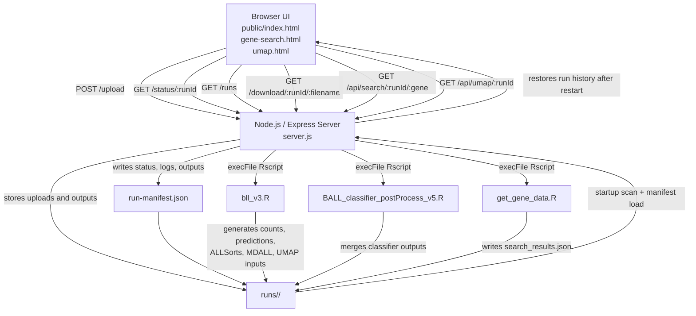

# B-ALL RNA-Seq Classifier

Web application for running the B-ALL RNA-seq classification pipeline from a browser. The app accepts a `quant.sf` file, runs the R-based pipeline, and writes results plus run metadata into a per-run folder under `runs/`.

## Requirements

Before starting, make sure these are installed on the machine:

- Node.js 18 or newer
- npm
- R 4.2 or newer
- `Rscript` available on your `PATH`
- The R packages used by the pipeline:
  - `dplyr`
  - `stringr`
  - `tidyverse`
  - `ALLCatchR`
  - `optparse`
  - `getopt`
  - `progress`
  - `Rphenograph`
  - `SummarizedExperiment`
  - `MDALL`
  - `vroom`
  - `stringi`
  - `reshape2`
  - `jsonlite`
  - `uwot` (optional, used for true UMAP output; otherwise the app falls back to PCA-style coordinates)
- An ALLSorts installation. `bll_v3.R` looks for the executable in the `ALLSORTS_BIN` environment variable and falls back to `/opt/anaconda3/envs/allsorts/bin/ALLSorts`.

The app also expects a GTF mapping file. By default it uses:

```text
resources/gtf1.txt
```

You can override that with the `GTF_FILE` environment variable.

## Install

1. Clone the repository:

```bash
git clone https://github.com/vyellapa/ball-classifier-web.git
cd ball-classifier-web
```

2. Install Node dependencies:

```bash
npm install
```

3. Install the required R packages. Example:

```r
install.packages(c(
  "dplyr",
  "stringr",
  "tidyverse",
  "optparse",
  "getopt",
  "progress",
  "vroom",
  "stringi",
  "reshape2",
  "jsonlite",
  "uwot"
))
```

Some packages in this project are usually installed from Bioconductor or other project-specific sources, including:

- `SummarizedExperiment`
- `MDALL`
- `ALLCatchR`
- `Rphenograph`

Install those using the method required by your lab or environment.

4. Make sure `resources/gtf1.txt` exists, or set a custom path:

```bash
export GTF_FILE=/absolute/path/to/gtf1.txt
```

5. Confirm ALLSorts is installed. If your binary is somewhere other than the default path, set `ALLSORTS_BIN=/path/to/ALLSorts` before starting the server.

If you would rather not install any of this by hand, see the **Docker** section below.

## Run

Start the server:

```bash
npm start
```

For development with auto-reload:

```bash
npm run dev
```

The app runs at:

```text
http://localhost:3000
```

## How To Use

1. Open `http://localhost:3000`.
2. Upload a `quant.sf` file.
3. Optionally upload a custom GTF file.
4. Set the run label and confidence thresholds if needed.
5. Start the run and wait for processing to finish.

Results are written to:

```text
runs/<run-id>/
```

Each run directory also stores a `run-manifest.json` file that records:

- Run label
- Status
- Timestamps
- Log output
- Output file list
- Any terminal error message

This means previous runs remain visible in the web UI after a server restart. If the server stops while a pipeline is still running, that run is restored in the UI as `interrupted` on the next startup.

Typical output files include:

- `B-ALL_final_calls_<date>.txt`
- `B-ALL_merged_calls_<date>.txt`
- `MDall_output_<run-label>.txt`
- `counts.csv`
- `counts.v2.csv`
- `predictions.tsv`
- `allsorts_results/probabilities.csv`

## Architecture



At a high level, the browser talks only to the Express server. The server owns file upload, job lifecycle, restart recovery, and execution of the R scripts. Each run is isolated in `runs/<run-id>/`, which contains both the generated analysis files and the persisted `run-manifest.json` used by the UI history.

## Project Layout

```text
.
├── server.js
├── package.json
├── public/
├── resources/
├── runs/
└── scripts/
```

## Docker

The `Dockerfile` builds one image containing the Node server, R 4.4 with every pipeline package (including the pinned GitHub builds of `ALLCatchR`, `MDALL` and `Rphenograph`), and an isolated Python 3.8 environment for ALLSorts. Nothing from your local machine is required at runtime.

Build for `linux/amd64` (the pinned ALLSorts wheels only exist for x86_64; on Apple Silicon this builds under emulation and takes a while):

```bash
docker build --platform linux/amd64 -t ball-classifier .
```

Run with Compose (persists `runs/` in a named volume and restarts on failure):

```bash
docker compose up -d
```

Or plain `docker run`:

```bash
docker run -d --name ball-classifier -p 3000:3000 \
  -v ball-runs:/app/runs \
  --memory 8g \
  ball-classifier
```

Then open `http://<host>:3000`.

Environment variables:

| Variable       | Default                      | Purpose                                   |
|----------------|------------------------------|-------------------------------------------|
| `PORT`         | `3000`                       | Port the server listens on                |
| `GTF_FILE`     | `/app/resources/gtf1.txt`    | Default GTF mapping file                  |
| `ALLSORTS_BIN` | `/opt/allsorts/bin/ALLSorts` | ALLSorts executable used by `bll_v3.R`    |
| `APP_PASSWORD` | unset                        | If set, every page and download requires HTTP basic auth (user `APP_USER`, default `admin`) |
| `RUNS_DIR`     | `/app/runs`                  | Where uploads, outputs and run history are stored |

Run history lives in the `ball-runs` volume. Delete it with `docker volume rm ball-runs` to start fresh.

### Hugging Face Spaces

This repository is ready to run as a Docker Space; the YAML block at the top of this README is the Space configuration. Hugging Face builds the image on its own servers, so nothing needs to be built locally.

1. Create a Space at https://huggingface.co/new-space. Choose **Docker** as the SDK, the free **CPU basic** hardware (2 vCPU, 16 GB RAM), and visibility **Private**. A private Space is visible only to you (or to members of an org you create it under); the sample names, uploads and results are never listed publicly.
2. Push this repository to the Space:

```bash
git init                       # skip if already a git repo
git add .
git commit -m "B-ALL classifier"
git remote add space https://huggingface.co/spaces/<your-username>/<space-name>
git push space main            # or master, whichever branch you are on
```

3. In the Space's **Settings → Variables and secrets**, add a **secret** named `APP_PASSWORD`. This is mandatory on Hugging Face: the server detects that it is running in a Space and refuses to start without it, so a misconfigured Space shows a runtime error instead of exposing data. Every visitor then has to enter user `admin` and that password. Add `APP_USER` as a variable to change the user name.
4. Watch the **Logs** tab. The first build takes roughly 15 to 25 minutes (R packages, then Python). Later builds reuse cached layers.

Notes for the free tier:

- Storage is ephemeral: run history is wiped whenever the Space restarts or rebuilds. To keep it, add **Persistent storage** (paid, mounted at `/data`) in the Space settings and set the variable `RUNS_DIR=/data/runs` under **Settings → Variables**.
- A free Space sleeps after 48 hours without traffic; the first visit afterwards takes a minute or two.
- Uploaded quant.sf files are stored on Hugging Face's servers, visible only through the password-protected app (and to Hugging Face itself). Keep the Space private and upload only de-identified samples.

### Before exposing it publicly

Without `APP_PASSWORD` the app has no authentication. Anyone who can reach the port can upload files, list every run, and download every result, including other users' uploads. Put it behind a reverse proxy that enforces login (for example Caddy/nginx with basic auth, or your institution's SSO), terminate TLS there, and only publish port 3000 to that proxy rather than to the internet.

## Notes

- `node_modules/` is only needed in the repository for offline or restricted environments where dependencies cannot be installed during deployment. In normal Git-based workflows, commit `package.json` and `package-lock.json` instead and run `npm install` on the target machine.
- Run history is persisted on disk inside each `runs/<run-id>/run-manifest.json`, so restarting the server does not clear the UI history.
